# Visualizcy

System diagrams that actually run. Nodes have capacity, traffic flows as discrete
packets, and when you overload or kill something the diagram shows you what breaks.

Vanilla JS, canvas 2D, zero dependencies, no build step.

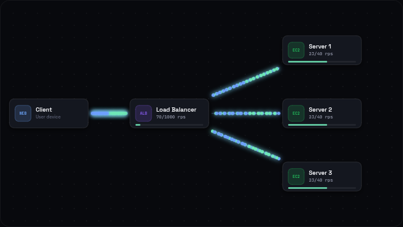

The same scene at 9:16, from the same data:

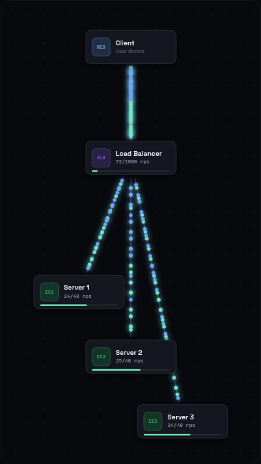

## Run it

```bash
cd Visualizcy
python3 -m http.server 8123
# open http://localhost:8123
```

A server is required because the code uses ES modules; `file://` will not work.

## The model

Three mechanics carry the whole thing:

**1. Sources emit on a rate accumulator.** A node with `role: 'source'` adds `dt`
to an accumulator and emits one packet per `1000/rps` milliseconds. Rate stays
exact regardless of frame timing.

**2. A packet is a progress value.** Each packet holds `progress` from 0 to 1
along one edge, plus a `trail` of the nodes it has passed. At 1 it arrives.
Position on screen is a lerp between the two card edges. No physics.

**3. A 1-second sliding window is what "overloaded" means.** Every node keeps
`rxLog`, the timestamps of recent arrivals. Because the window is exactly one
second, `rxLog.length` *is* the node's current rps. Compare it to `capacity`:
over the line, the node turns red and drops.

Requests travel forward and turn into responses at a `sink`, which retrace the
trail back to the source. Only requests consume capacity — responses are work
already paid for, so counting them would double every meter.

Routers fan out **round robin** via `rrIdx++ % outs.length`. That single line is
the entire load-balancing behaviour.

## Layout: fractions, never pixels

Node positions are fractions of the canvas (`0.42, 0.5`), so one scene renders at
16:9, 1:1 and 9:16 without being rebuilt. A node may also carry a `portrait`
position used when the canvas is taller than wide:

```js
n('lb', 'lb', 0.42, 0.5, { portrait: [0.5, 0.34] })
```

This is what makes the same source material work for a wide diagram and a vertical
video without duplicating anything.

## Motion

Simulation state is exact; presentation state is damped separately in
`advanceAnim`, which runs every frame whether or not the sim is running. Easing
therefore never distorts the numbers it is smoothing — a paused scene still
finishes its entrance, and a meter keeps settling after you hit pause.

- **Entrances run in flow order.** A BFS from the sources assigns each node a
  depth, and depth becomes the stagger delay. Reading the diagram and watching it
  build are the same motion. Cards rise, overshoot slightly (`easeOutBack`), settle.
- **Nodes animate out, not only in.** Hiding used to be instant, so every step
  change was a cut and a sequence of cuts is what made stepping feel abrupt.
  Exit is shorter than entrance (280ms vs 460ms) because leaving should not
  linger.
- **Wires draw themselves only as far as both endpoints have arrived**, so the
  topology assembles rather than snapping into place.
- **`damp()` is the workhorse.** Frame-rate independent exponential smoothing,
  used for the displayed rps and for the overload blend. Measured on the load
  balancer scene, it cuts frame-to-frame meter jitter from 0.385 to 0.084 while
  holding the mean (23.55 raw vs 23.37 displayed).
- **Packet position stays linear.** This is a stream; easing each dot would make
  the flow clump at the ends. Only size and glow ease, and only near the cards.

## Timelines

A scene with a `steps` array becomes a story with frame chrome: step label and
narration top-left, author top-right, section bottom-left, `n / total` bottom-right.

Each step declares the **full** state it wants — visible nodes, live edges, who is
sending, what is dead — not a delta from the step before. Any step is therefore
reachable directly, and stepping to it by playing through, jumping forward, or
walking backwards all produce byte-identical state. That property is what makes
deterministic frame-by-frame video export possible later.

```js
{
  label: 'Traffic triples',
  note: 'Same server, seventy requests a second arriving.',
  duration: 4600,
  show: ['client', 's1'],          // everything else is hidden
  edges: ['client>s1'],            // everything else is muted
  traffic: { client: 70 },         // sources not named here fall silent
  dead: ['s2'],                    // optional
  clearPackets: true,              // optional, for a hard cut
}
```

`edges` matters more than it looks: without it a client wired to two future
routes would quietly split its traffic down a path the story has not introduced.

See `scaleStory` in `scenes/index.js` for a six-step example.

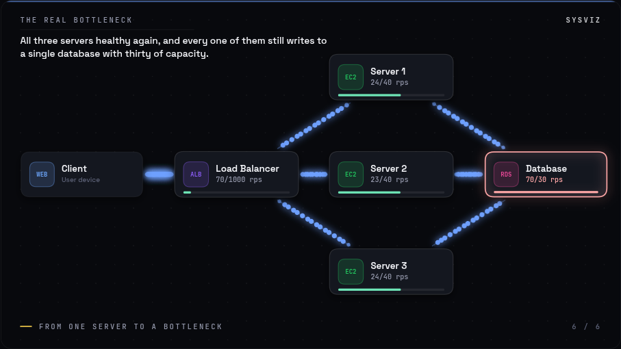

## The canvas

The camera is applied once as a canvas transform around the whole composition,
so every painter keeps working in frame coordinates and the artboard zooms as
one piece. At zoom 1 centred on the frame the output is pixel-identical to
having no camera at all; zoom out and a dashed outline shows the export bounds.

- **wheel** zooms about the cursor
- **drag empty space** pans
- **double-click** resets

With many nodes the fit pass shrinks cards until they stop colliding, so labels
fall back to a shorter registry name (`Load Balancer` → `Balancer`). A shorter
real word says more than an ellipsis. Zoom in for the rest.

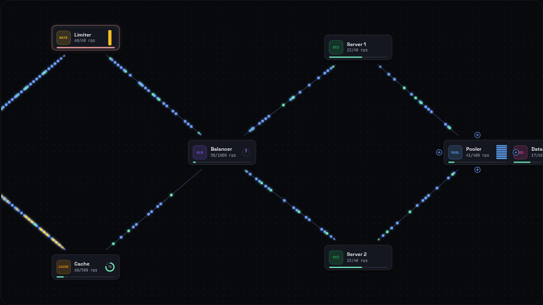

## The app shell

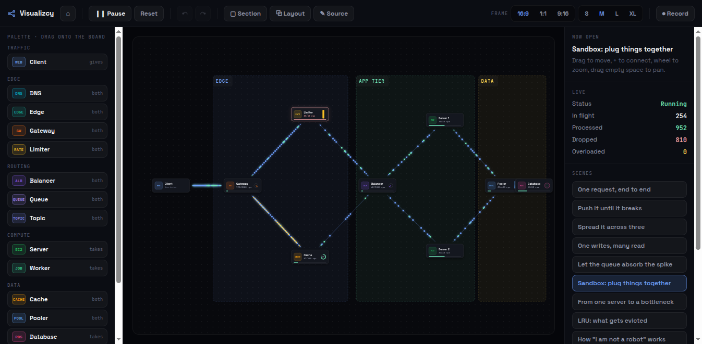

Four regions with fixed roles: a toolbar of **verbs** grouped and separated by
rules, a **palette** of nouns on the left, the **stage**, and a **context** panel
on the right. The timeline strip appears only for scenes that have steps — an
empty strip is worse than no strip.

Frame geometry is computed in `sizeFrame()`, not left to CSS. Two attempts at
`aspect-ratio` with competing constraints both failed the same way: with a width
and a max-height set, the browser clips the other axis instead of shrinking it,
which is how 1:1 and 9:16 both ended up 810x520. Fitting the ratio inside the
stage and scaling by the size control is exact and testable:

| | 16:9 | 1:1 | 9:16 |
|---|---|---|---|
| size | 810x456 | 520x520 | 293x520 |

At S/M the whole frame is visible; L and XL overflow deliberately and the stage
scrolls. `.claude/skills/visualizcy-ui/SKILL.md` records the rules and the
mistakes so the next change does not repeat them.

## Rendering a video

⏺ renders the loaded story to a `.webm`.

The mechanism is `captureStream(0)` — a manual-frame track, where nothing is
captured until the code asks for it. That lets the engine be stepped by a
**fixed dt per frame** instead of by the display's clock, so a slow machine
produces the same video as a fast one. The calls are still paced in real time,
because MediaRecorder timestamps by wall clock; export therefore takes about as
long as the clip, while the content stays frame-exact.

One gotcha worth knowing: because the frames are pushed manually, MediaRecorder
writes a nonsense frame rate (ffprobe reads `1000/1`) and a duration a few
percent short. The pictures are fine; the timing metadata is not. Forcing a
constant rate on the way out fixes both:

```bash
./tools/to-mp4.sh captcha_short-9x16.webm
```

Measured on a 2s probe: 60 frames pushed in, 60 frames out, duration exactly
2.000000 at 30/1.

## Trace scenes

`kind: 'trace'` draws measured paths rather than a topology, in a blueprint
style — stroke instead of fill, dashed for containers and solid for the subject,
depth from opacity rather than shadow, every label monospace and letter-spaced,
two accents and no third. Those rules are the whole difference from the filled
cards of the graph renderer; the engine needed nothing new.

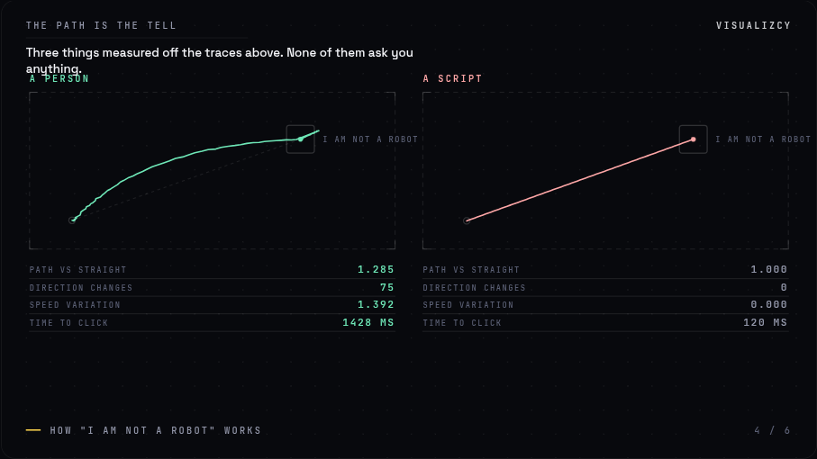

`scenes/captcha.js` uses it for what the "I am not a robot" checkbox actually
reads. The two paths are **generated**, and every number shown is measured off
them — nothing is typed in:

| | path vs straight | direction changes | speed variation | time |
|---|---|---|---|---|
| A person | 1.285 | 75 | 1.392 | 1428 ms |
| A script | 1.000 | 0 | 0.000 | 120 ms |

The script's `1.000` and `0` are not round numbers chosen for effect — they are
what a straight line at constant speed measures. That matters, because the claim
of the piece is that the difference is visible in the trace, so the figures had
better come out of the trace.

### One frame, not a slideshow

A ten-second clip cannot afford a page change. Layout is therefore computed from
the **union of every step**, never from the current one: panels keep their slot
from the first frame and fill in rather than arriving, so nothing re-flows.

| | beat 1 | beat 3 |
|---|---|---|
| 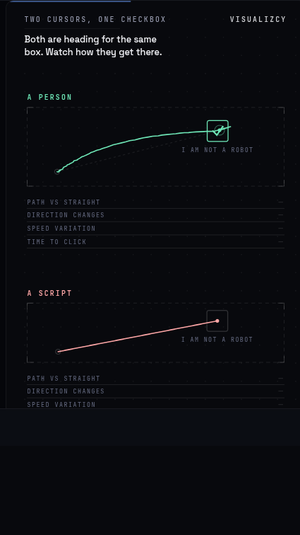 | traces drawing, metrics `—` | values filled, verdicts in their slots |

Lanes are identical across all three steps (2, 2, 2). Only the state moves.

Each lane also draws at **its own measured pace**: the script's 120 ms against a
person's 1428 ms means its trace is finished while the other is still curving.
Stepping through pages hid that; one still frame shows it.

Two cuts of the same material: a 31s lesson and a 10s reel.

## Starting

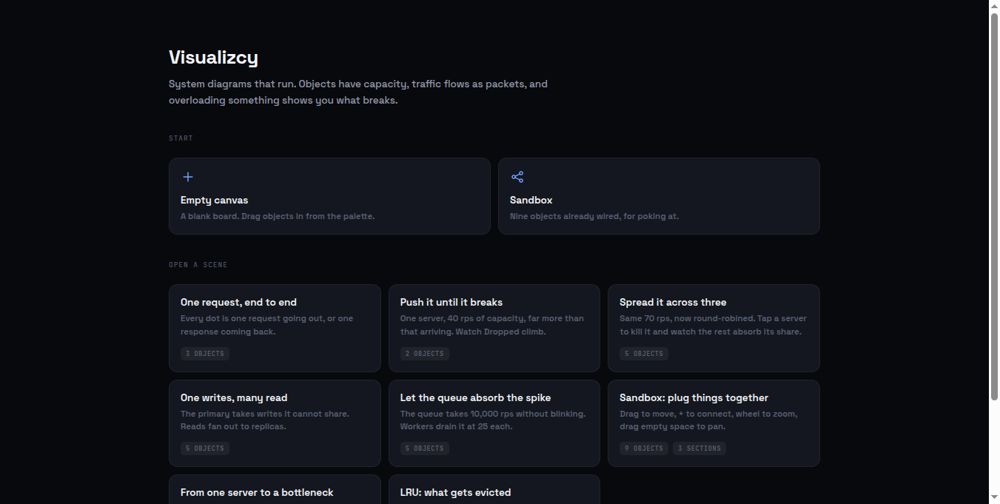

The app used to open straight into whichever scene came first, which left no way
to begin from nothing. **Empty canvas** gives you a blank board; the grid below
opens any scene. ⌂ returns.

A blank board is a legitimate state, so the validator no longer treats an empty
`nodes` array as an error — only nodes *without a source* still warn.

## Undo

Ctrl+Z / Ctrl+Shift+Z, or ↶ ↷. Snapshot-based rather than inverse commands: a
board is small enough that copying it is cheap, and every mutation gets undo for
free instead of each one needing a hand-written inverse to keep in step.

Two properties worth knowing:

- **One gesture is one step.** `mark()` runs at pointerdown, not on every move,
  so an eight-move drag undoes once rather than eight times.
- **Restore happens in place.** Surviving nodes keep their runtime state, so
  undoing a wire change does not also reset the traffic flowing through it.

A refused connection is not a step: the mark is popped back off.

## The board is bigger than the frame

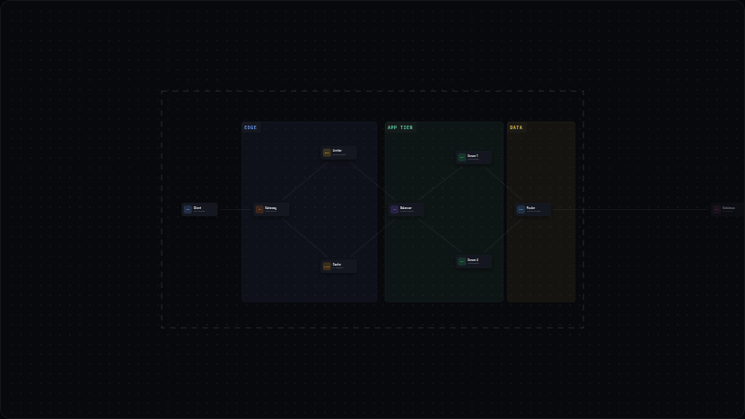

`0..1` is the **export frame**, not the world. Objects can be parked outside it:
they stay on the board, keep their wires, and simply do not appear in a render.
The board runs `-1.5` to `2.5`, bounded so a stray drag cannot fling something a
thousand screens away.

This was wrong for a while. Two clamps caged everything inside the frame — one in
the drag handler, one in `boxOf()` — which made the pan/zoom canvas a lie: you
could travel to empty space but nothing could live there. Both are gone.

Three things follow from it:

- An object outside the frame renders at 40% opacity, so what will not be in the
  video is visible at a glance.
- The dashed frame outline now appears whenever anything is parked outside, not
  only when the camera has moved.
- `fit()` ignores parked objects when deciding how much to shrink cards —
  otherwise one thing set aside would shrink everything that stayed.

The validator matches: outside the frame is a **warning** ("will not appear in a
render"), only past the board edge is an error.

## The palette

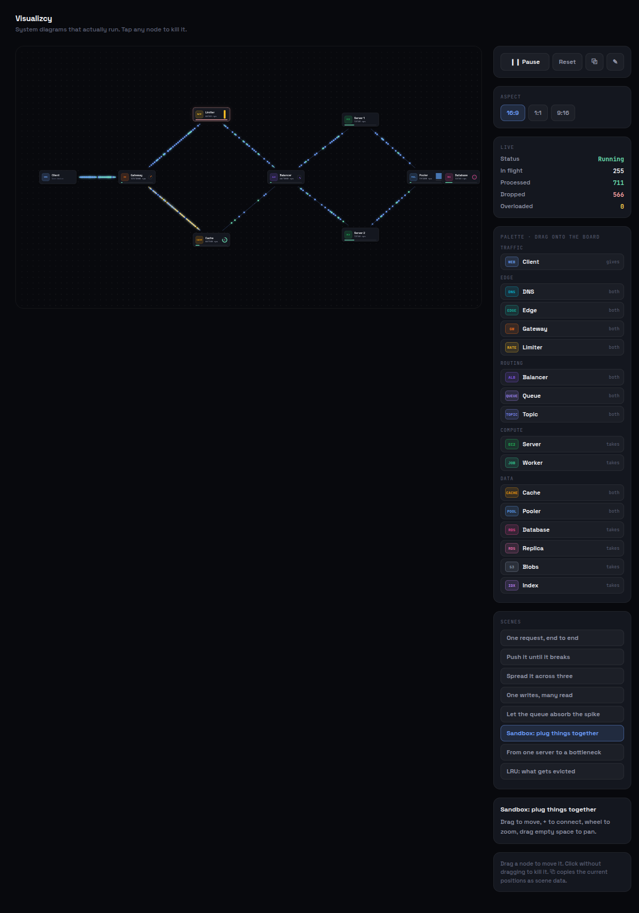

Drag a type onto the board to place it. The palette is generated straight from
`registry.js`, so adding a type there is all it takes to make it placeable —
there is no second list to keep in sync. Each row shows the role, because that
is what decides where it can be wired: **gives**, **takes**, or **both**.

Right-click removes: a node with all its wires, or a single wire. The wire under
the cursor turns red first, so what a right-click would remove is visible before
the click. Adding and removing write through to the scene definition as well as
the running state, so the ✎ editor and ⧉ layout copy always agree with what is
on screen.

## Sections

Grouping, and nothing more: a labelled rectangle behind the nodes.

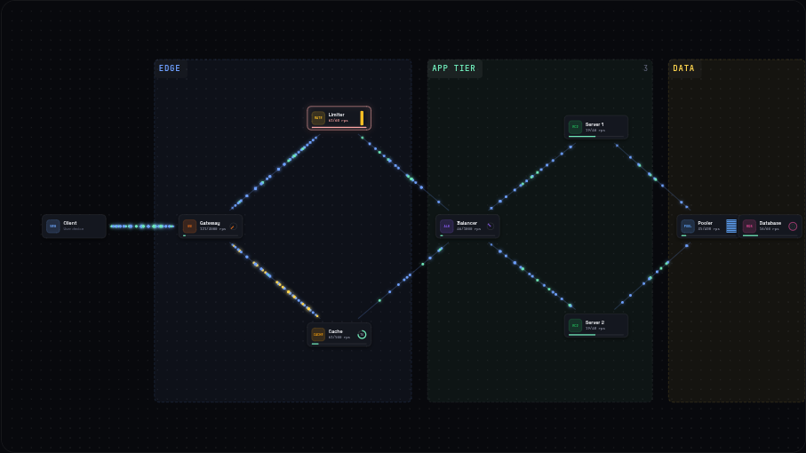

```js
sections: [
  g('sec_edge', 'Edge',     0.19, 0.13, 0.32, 0.76, { tone: 'accent' }),
  g('sec_app',  'App tier', 0.53, 0.13, 0.28, 0.76, { tone: 'good' }),
]
```

Two decisions carry it:

- **Membership is geometric.** Whatever sits inside the rectangle belongs to it,
  recomputed on demand rather than stored. Drag a node in or out and it just
  works — there is no membership list to drift out of sync with where things
  actually are.
- **Only the title strip is grabbable**, and it moves the section with its
  contents. Making the whole body a drag target would fight panning and node
  selection. The strip is floored at 21px because it is chrome, not content: on
  a dense board the card scale drops to 0.42, which would leave a 10px handle.

Right-click the strip to remove the grouping; the nodes it held stay exactly
where they are. ▢ adds one.

## Plugging things together

Drag from a **+** handle to wire one node to another. Handles only appear on
nodes that may give traffic, so "this one is receive-only" is visible rather
than a rule you discover by being refused.

The rule is the `role` a scene already declares:

| role | gives | receives |
|---|---|---|
| `source` | yes | no |
| `router` | yes | yes |
| `sink` | no | yes |

A refused connection says why: *"Database only receives"*, *"Client only
sends"*, *"a node cannot feed itself"*, *"already connected"*.

## What each object does

Types are not just colours. Several carry real behaviour that changes what the
simulation produces:

| type | behaviour | shown as |
|---|---|---|
| `cache`, `edge` | `hitRate` of requests turn around here and never touch what is behind | ratio ring, amber return packets |
| `ratelimit` | token bucket, refills at `capacity`/sec up to `burst` | bucket level |
| `pooler` | a fixed set of connections, checked out on the way in and returned on the way back | slot bars |
| `lb`, `gateway`, `topic` | round robin across live targets | stepping dial |
| `queue` | backlog against drain rate | depth bar |
| `db`, `blob`, `search` | write pulse | disk rings |

The cache one matters most: without it a cache was a box that forwarded
everything, which taught nothing. Measured on the sandbox scene, an 0.8
`hitRate` produced 153 hits against 38 misses — and 153 requests that never
reached the database.

The pooler produces the scenario worth showing: the database sits at 19 rps of
60 while the system drops 128 requests, because the pool ran out of connections.
Nothing downstream is overloaded. It is still broken.

## Interaction

- **Drag a node** to move it. Positions stay fractional, so the drag writes back
  into the scene spec for whichever layout is on screen — rearrange at 9:16 and
  the 16:9 layout is untouched.
- **Click without dragging** to kill a node. One gesture, two meanings, split by
  a 4px threshold so a shaky click still reads as a click.
- **⧉** copies the current positions as scene data, ready to paste back into
  `scenes/index.js`. Drag to compose, copy, commit.

## Layout

Two things were static that should not have been.

**Node positions.** A scene authors coordinates for its full topology, but a step
shows a subset — so a step displaying two of six nodes was using positions
designed for six, and the composition fell apart mid-story. `autoLayout: true`
recomputes positions per step from the *live* edges: BFS assigns each visible
node a depth, depth becomes the position along the flow, and siblings spread
across it. Two nodes become a centred pair; six become four layers.

**Annotation rhythm.** See above: marks without `at` stack on measured heights.

## Fitting any aspect

Scale is driven by width, not `min(W, H)` — cards are wide, so horizontal room is
what constrains them. Then `fit()` walks every visible pair and shrinks until
nothing collides, because how much room a layout really has is only knowable once
the canvas is sized. Measured on the load balancer scene:

| Aspect | Canvas | Scale | Card | Tightest clearance |
|---|---|---|---|---|
| 16:9 | 904x508 | 1.03 | 173px | 78px |
| 1:1  | 618x618 | 0.70 | 118px | 67px |
| 9:16 | 378x674 | 0.88 | 148px | 40px |

## Annotations

A card can only say what it is. An annotation says what to *notice* about it —
the number that matters, the comparison, the sentence that lands. This layer is
pure typography and geometry: no illustration involved, and it is what turns a
diagram into an explanation.

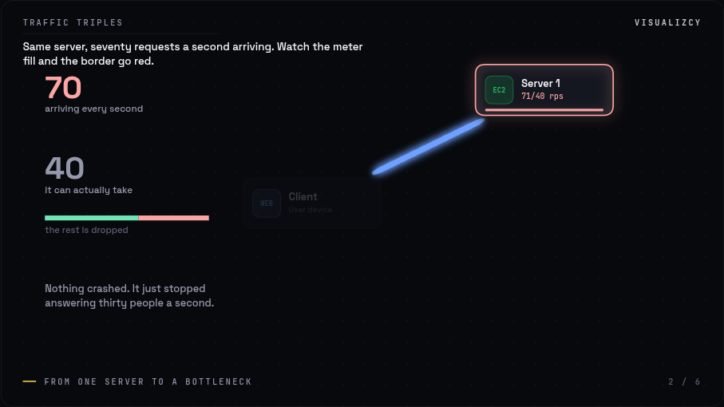

Marks are declared as data on a timeline step and anchor either to a node id (so
they follow drags and relayouts) or to a fractional position:

```js
{
  label: 'Traffic triples',
  gutter: 0.33,                     // reserve the left third for commentary
  focus: ['s1'],                    // dim everything else
  annotations: [
    { type: 'stat', at: [0.06, 0.24], value: 70, tone: 'bad',
      label: 'arriving every second', key: 'in' },
    { type: 'bar', at: [0.06, 0.53], label: 'the rest is dropped',
      parts: [{ value: 40, tone: 'good' }, { value: 30, tone: 'bad' }] },
    { type: 'callout', at: 'db', text: 'Every server you added ends here.' },
    { type: 'bracket', nodes: ['s1','s2','s3'], text: 'three shares of 23' },
    { type: 'note', at: [0.06, 0.72], text: 'Nothing crashed.' },
  ],
}
```

Three things make this layer work rather than merely exist:

- **Marks that omit `at` are stacked down the gutter** on spacing derived from
  their own measured heights. Hand-picking a y per mark is how the column ended
  up with arbitrary gaps; rhythm has to be computed, not chosen.
- **`gutter` reserves the left edge** and the diagram maps its fractional x into
  what is left. Without it, commentary lands on cards. This is the layout
  language the reference work uses: system on one side, argument on the other.
- **Callouts choose their own side.** Right, left, below, above are scored by how
  much they overlap other cards and the cheapest wins. A callout that covers a
  node is worse than no callout, and which side is free depends on the topology.
- **`stat` counts toward its value** instead of snapping, keyed per step so each
  beat starts fresh.

`focus` costs the author one array and is the cheapest way to aim the eye.

## Scene kinds

A scene declares its `kind`; the kind decides how the body of the frame is drawn.
Everything around it — background, annotations, chrome, focus, easing, the
timeline — is shared. That is the whole point of the split: **a new visual
vocabulary costs one function, not a second engine.**

- `graph` (default) — nodes, wires, packets, capacity. Built in.
- `slots` — a row or column of cells whose contents change per step, with
  pointers naming positions. `src/renderers/slots.js`.

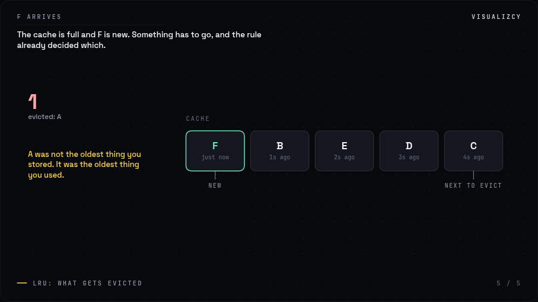

`slots` exists because a node graph cannot say what an LRU cache does. One shape
covers caches, the stack and the heap, hash buckets, cache tables and shard maps
— which is roughly half of what the reference work draws.

```js
scene({
  id: 'lru', kind: 'slots',
  slots: { count: 5, label: 'Cache' },
  steps: [{
    label: 'F arrives', duration: 5000,
    cells: [{ text: 'F', sub: 'just now', tone: 'good' }, { text: 'B', sub: '1s ago' }],
    pointers: [{ at: 0, text: 'new' }, { at: 4, text: 'next to evict' }],
  }],
})
```

Register another with `registerRenderer(kind, fn)`; it receives a drawing surface
and returns a Map of boxes so annotations can anchor to whatever it drew. A cell
that changes between steps flashes, which is what makes an eviction readable
rather than merely different.

For one odd mark rather than a whole kind, `registerMark(type, fn)` adds to the
annotation vocabulary. That is deliberately a plain function: a scripting DSL
would be weaker than the JavaScript already available, and much harder to
generate correctly.

## Validation

`validateScene(def)` returns `{ errors, warnings, ok }`. The point is not safety,
it is **generation**: a scene is data, so it can be written by a tool or a model
— but only if a wrong scene fails specifically.

```
ERROR  nodes[1].type: unknown node type "postgres". known types: client, dns, edge, lb, ...
ERROR  steps[0].edges: "a>c" is not an edge in this scene. declared edges: a>zzz, c>c
ERROR  steps[0].gutter: gutter is 1.4; it is a fraction of the width, so 0..0.9
```

Every message names the valid options, so a generator can correct itself from the
error alone. `validateAll(SCENES)` runs on page load and reports to the console.

## Sandbox

The ✎ button opens the current scene as editable JSON under the canvas. Edits are
debounced, validated, and applied live; invalid ones report why and leave the
running scene alone. It is a small feature only because the scene was already
data.

## Add a scene

`scenes/index.js`:

```js
export const mine = scene({
  id: 'mine',
  title: 'Short imperative title',
  caption: 'One line telling the viewer what to watch for.',
  nodes: [
    n('client', 'client', 0.15, 0.5, { rps: 40, portrait: [0.5, 0.12] }),
    n('srv',    'server', 0.55, 0.5, { role: 'router' }),
    n('db',     'db',     0.85, 0.5, { capacity: 25 }),
  ],
  edges: [e('client', 'srv'), e('srv', 'db')],
})
```

Then add it to the `SCENES` array. Per-node options: `rps`, `capacity`, `label`,
`role`, `portrait`. `role` matters because an App Server is a sink in one topology
and a router in another.

## Add a node type

`src/registry.js`. Four fields do the work:

```js
gateway: {
  name: 'API Gateway', subtitle: 'Entry point', icon: 'GW',
  color: '#f97316', role: 'router', capacity: 3000,
  hint: 'Terminates TLS and routes by path',
},
```

## Theming

Every colour, font and card dimension lives in `src/theme.js`. Nothing else
hardcodes a colour, so a rebrand is one file.

## Files

```
src/theme.js      design tokens and card geometry
src/ease.js       easing curves and the damp() smoother
src/registry.js   node types: role, capacity, colour, icon
src/scene.js      scene spec helpers and fractional placement
src/sim.js        the simulation plus presentation state
src/timeline.js   step sequencing for story scenes
src/annotate.js   annotation marks: stat, bar, callout, bracket, note
src/validate.js   scene schema and error reporting
src/renderers/    additional scene kinds
src/render.js     canvas 2D renderer
src/engine.js     rAF loop, resize, click-to-kill
scenes/index.js   the demo scenes
index.html        demo harness
```

## Not in here yet

Deliberately left out of v1, in rough order of usefulness:

- **Cache hit ratio.** A `hitRate` on cache nodes so a hit short-circuits back
  instead of forwarding to the database. This is the one that unlocks a whole
  category of scenes.
- **Latency per node.** Packets currently travel at constant speed; per-node
  service time would let slow databases actually look slow.
- **Retries, backoff, circuit breaker.** All expressible on top of the trail that
  packets already carry.
- **Video export.** Headless render to frames, then a scene spec becomes an MP4
  without screen recording. Timelines are already deterministic, so this is
  mostly plumbing.
- **Illustration assets.** Phones, buildings, maps as inline SVG placed into a
  scene. The reference work leans on these heavily; they are static art, not
  another engine.
- **Read/write packet kinds.** Needed before a primary/replica scene teaches
  anything beyond fan-out.
